# Design of Responsive Website
## AIM:
To design a responsive website with two break points.

## DESIGN STEPS:
### Step 1: 
Requirement collection.
### Step 2:
Creating the layout using HTML and CSS.
### Step 3:
Updating the sample content.
### Step 4:
Choose the appropriate style and color scheme.
### Step 5:
Validate the layout in various browsers.
### Step 6:
Validate the HTML code.
### Step 7:
Create a database model and migrate the database.
### Step 8:
Retrieve data from database and display it in a dynamic webpage.
### Step 9:
Publish the website in the given URL.

## PROGRAM:

## responsivebase.html
```

<!doctype html>
<html lang="en">

<head>
    <!-- Required meta tags -->
    <meta charset="utf-8">
    <meta name="viewport" content="width=device-width, initial-scale=1, shrink-to-fit=no">

    <!-- Bootstrap CSS -->
    <link rel="stylesheet" href="https://maxcdn.bootstrapcdn.com/bootstrap/4.0.0/css/bootstrap.min.css"
        integrity="sha384-Gn5384xqQ1aoWXA+058RXPxPg6fy4IWvTNh0E263XmFcJlSAwiGgFAW/dAiS6JXm" crossorigin="anonymous">

    <title>PK Industries Limited</title>
</head>

<body>
    <div class="jumbotron">
        <div class="container text-center">
            <h1 class="display-3">PK Industries Limited</h1>
            <p class="lead">We manufacture high qualilty electronic products</p>
        </div>
    </div>
    <div class="container">
        <div class="row text-center">
            <div class="col-12 col-md-3"><a href="/responsivehome">Home</a></div>
            <div class="col-12 col-md-3"><a href="/responsiveproduct">Product</a></div>
            <div class="col-12 col-md-3"><a href="/responsivepeople">People</a></div>
            <div class="col-12 col-md-3"><a href="/responsivecontactus">Contact us</a></div>
        </div>
    </div>
    <div class="container">
        
        
    </div>
    <div class="container">
        <div class="row align-items-end">
            <div class="col text-center">
                Copyright © 2021 PK Industries Limited, Developed by PRASANNA KUMAR
            </div>
        </div>
    </div>
    <!-- Optional JavaScript -->
    <!-- jQuery first, then Popper.js, then Bootstrap JS -->
    <script src="https://code.jquery.com/jquery-3.2.1.slim.min.js"
        integrity="sha384-KJ3o2DKtIkvYIK3UENzmM7KCkRr/rE9/Qpg6aAZGJwFDMVNA/GpGFF93hXpG5KkN"
        crossorigin="anonymous"></script>
    <script src="https://cdnjs.cloudflare.com/ajax/libs/popper.js/1.12.9/umd/popper.min.js"
        integrity="sha384-ApNbgh9B+Y1QKtv3Rn7W3mgPxhU9K/ScQsAP7hUibX39j7fakFPskvXusvfa0b4Q"
        crossorigin="anonymous"></script>
    <script src="https://maxcdn.bootstrapcdn.com/bootstrap/4.0.0/js/bootstrap.min.js"
        integrity="sha384-JZR6Spejh4U02d8jOt6vLEHfe/JQGiRRSQQxSfFWpi1MquVdAyjUar5+76PVCmYl"
        crossorigin="anonymous"></script>
</body>

</html>
```
## responsivehome.html
```



<div class="card">
  
  <div class="card-body">
    <h5 class="card-title">About Us</h5>
    <p class="card-text">PK Industries Limited, provides a broad range of semiconductor and infrastructure software applications that serve the data center, networking, software, broadband, wireless, and storage and industrial markets. Common applications for its products include: data center networking, home connectivity, broadband access, telecommunications equipment, smartphones, base stations, data center servers and storage, factory automation, power generation and alternative energy systems, displays, and mainframe operations and management, and application software development. Some of Silicon's core technologies and products include:
    <ul>
        <li>Memory Chips</li>
        <li>SATA HDD</li>
        <li>SATA SSD </li>
        <li>Broadband Modems</li>
        <li>Wifi Devices</li>
        <li>Switching Devices</li>
        <li>Optical Sensors</li>
    </ul> 
  </div>
</div>

```

## responsiveproduct.html
```



<div class="row text-center">
    <div class="col-12">
        <p class="lead">Our Premium Products</p>
    </div>
  
</div>
<div class="row text-center">
    <div class="card col-12 col-md-6 col-lg-3">
    
    <div class="card-body">
        <h5 class="card-title"><b> RAM 4GB DDR4</b></h5>
        <p class="card-text">(2666 MHz CL19 Desktop Memory)<br>Price: Rs.1,429.00</p>
        <a href="https://www.amazon.in/Crucial-4gb-ddr4-2666-Desktop/dp/B07GMRJTS9/ref=sr_1_5?dchild=1&keywords=ram&qid=1610077354&s=computers&sr=1-5" class="btn btn-primary">Buy now</a>
    </div>
    </div>
    <div class="card col-12 col-md-6 col-lg-3">
    
    <div class="card-body">
        <h5 class="card-title"><b>HyperX Fury 8GB DDR4</b></h5>
        <p class="card-text">(3200MHz CL16 XMP Desktop Memory)<br> Price: Rs.3,241.00</p>
        <a href="https://www.amazon.in/HyperX-3200MHz-Desktop-Memory-HX432C16FB3/dp/B07WJJ9CNG/ref=sr_1_3?dchild=1&keywords=ram&qid=1610077354&s=computers&sr=1-3" class="btn btn-primary">Buy now</a>
    </div>
    </div>
    <div class="card col-12 col-md-6 col-lg-3">
    
    <div class="card-body">
        <h5 class="card-title"><b>XPG DDR4 D60G RGB 16GB</b></h5>
        <p class="card-text">(3200MHz PC4-25600 U-DIMM)<br>Price: Rs.10,999.00</p>
        <a href="https://www.amazon.in/XPG-3200MHz-PC4-25600-CL16-20-20-AX4U320038G16A-DW60/dp/B0828CSTWC/ref=sr_1_2_sspa?dchild=1&keywords=ram&qid=1610094328&s=computers&sr=1-2" class="btn btn-primary">Buy now</a>
    </div>
    </div>
    <div class="card col-12 col-md-6 col-lg-3">
    
    <div class="card-body">
        <h5 class="card-title"><b>Seagate BarraCuda 1 TB HDD</b></h5>
        <p class="card-text">(HDD – 3.5 Inch SATA 6 Gb/s 7200 RPM)<br>Price: Rs.6500.00</p>
        <a href="https://www.amazon.in/Seagate-BarraCuda-ST1000DM010-Desktop-Latest/dp/B01LNJBA2I/ref=sr_1_2?dchild=1&keywords=hdd&qid=1610088209&s=computers&sr=1-2" class="btn btn-primary">Buy now</a>
    </div>
    </div>
    <div class="card col-12 col-md-6 col-lg-3">
    
    <div class="card-body">
        <h5 class="card-title"><b>Western Digital HDD for Desktop</b></h5>
        <p class="card-text"> (WD10EZEX 1TB Internal Hard Drive)<br>Price: Rs.5450.00</p>
        <a href="https://www.amazon.in/Western-Digital-WD10EZEX-Internal-Desktop/dp/B0088PUEPK/ref=sr_1_1?dchild=1&keywords=Western+Digital+Blue+1TB&psr=EY17&qid=1610099690&s=todays-deals&sr=1-1" class="btn btn-primary">Buy now</a>
    </div>
    </div>
    <div class="card col-12 col-md-6 col-lg-3">
    
    <div class="card-body">
        <h5 class="card-title"><b>Western Digital Gold 2TB HDD</b></h5>
        <p class="card-text">(Internal SATA Hard Drive (WD2005FBYZ))<br>Price: Rs.16,999.00</p>
        <a href="https://www.amazon.in/Western-Digital-Internal-Drive-WD2005FBYZ/dp/B01IY9UTMM/ref=sr_1_1?crid=1FMIGIV7SISBB&dchild=1&keywords=western+digital+hard+disk+gold&qid=1610100444&s=computers&sprefix=wes%2Ccomputers%2C369&sr=1-1" class="btn btn-primary">Buy now</a>
    </div>
    </div>
    <div class="card col-12 col-md-6 col-lg-3">
    
    <div class="card-body">
        <h5 class="card-title"><b>Western Digital WD Green 240 GB</b></h5>
        <p class="card-text">(SATA III (WDS240G2G0A))<br>Price: Rs.4,300.00</p>
        <a href="https://www.amazon.in/Western-Digital-WDS240G2G0A-240GB-Internal/dp/B076Y374ZH/ref=sr_1_1?dchild=1&keywords=sdd&qid=1610100140&s=computers&sr=1-1" class="btn btn-primary">Buy now</a>
    </div>
    </div>
    <div class="card col-12 col-md-6 col-lg-3">
    
    <div class="card-body">
        <h5 class="card-title"><b>Crucial BX500 240GB 3D NAND SSD</b></h5>
        <p class="card-text"> (SATA 2.5-inch SSD (CT240BX500SSD1))<br>Price: Rs.3,500.00</p>
        <a href="https://www.amazon.in/Crucial-BX500-240GB-2-5-inch-CT240BX500SSD1/dp/B07G3YNLJB/ref=sr_1_2?dchild=1&keywords=sdd&qid=1610100913&s=computers&sr=1-2" class="btn btn-primary">Buy now</a>
    </div>
    </div>
    <div class="card col-12 col-md-6 col-lg-3">
    
    <div class="card-body">
        <h5 class="card-title"><b>Seagate Barracuda Q1 SSD 240GB</b></h5>
        <p class="card-text"> (2.5 Inch SATA 6Gb/s (ZA240CV1A001))<br>Price: Rs.5,099.00</p>
        <a href="https://www.amazon.in/Seagate-Barracuda-240GB-Internal-Solid/dp/B08FJB98F1/ref=pd_sbs_147_3/259-4979351-0376003?_encoding=UTF8&pd_rd_i=B08FJB98F1&pd_rd_r=b0bac50d-3" class="btn btn-primary">Buy now</a>
    </div>
    </div>
    <div class="card col-12 col-md-6 col-lg-3">
    
    <div class="card-body">
        <h5 class="card-title"><b>TP-LINK TD-W8961N Wireless</b></h5>
        <p class="card-text"> (Wi-Fi Modem Router,2x 5dBi)<br>Price: Rs.2,399.00</p>
        <a href="https://www.amazon.in/TP-LINK-TD-W8961N-300Mbps-Antenna-Wireless/dp/B00RK5VU5M/ref=sr_1_2_sspa?crid=11RANSQBZB0TM&dchild=1&keywords=wifi+modem&qid=1610102045&s" class="btn btn-primary">Buy now</a>
    </div>
    </div>
    <div class="card col-12 col-md-6 col-lg-3">
    
    <div class="card-body">
        <h5 class="card-title"><b>TP-Link AC750 Wireless</b></h5>
        <p class="card-text"> (Portable Mini Travel Router (TL-WR902AC))<br>Price: Rs.2,199.00</p>
        <a href="https://www.amazon.in/TP-Link-TL-WR902AC-Wireless-Travel-Router/dp/B01N5RCZQH/ref=sr_1_15_sspa?crid=11RANSQBZB0TM&dchild=1&keywords=wifi+modem&qid=1610102045&s" class="btn btn-primary">Buy now</a>
    </div>
    </div>
    <div class="card col-12 col-md-6 col-lg-3">
    
    <div class="card-body">
        <h5 class="card-title"><b>Linksys Velop WiFi 6 AX 5300</b></h5>
        <p class="card-text"> (Whole-Home WiFi Mesh Network)<br>Price: Rs.39,999.00</p>
        <a href="https://www.amazon.in/dp/B07Z5NZ9CQ/ref=sspa_dk_detail_7?psc=1&pd_rd_i=B07Z5NZ9CQ&pd_rd_w=s4RPI&pf_rd_p=1801b34c-8af9-42b5-8961-11f124edc99b&pd_rd" class="btn btn-primary">Buy now</a>
    </div>
    </div>
</div>

```

## responsivepeople.html
```



    <div class="jumbotron">
        <div class="container text-center">
            <h1 class="display-3">PK Private Limited</h1>
            <h5 class="display-6">crew people</h5>
        </div>
    </div>
    <div class="row text-center">
        <div class="col-12">
            <h5 class="display-6">Our Crew People</h5>
        </div>
    </div>
    <div class="row text-center">
        <div class="card col-12 col-md-6 col-lg-3">
            
            <div class="card-body">
                <h5 class="card-title">TONY STARK</h5>
                <p class="card-text">President of a company</p>
                <a href="https://en.wikipedia.org/wiki/Iron_Man" class="btn btn-primary">More Details</a>
            </div>
        </div>
        <div class="card col-12 col-md-6 col-lg-3">
            
            <div class="card-body">
                <h5 class="card-title">ELON MUSK</h5>
                <p class="card-text">Cheif Executive Officer of a company</p>
                <a href="https://en.wikipedia.org/wiki/Elon_Musk" class="btn btn-primary">More Details</a>
            </div>
        </div>
        <div class="card col-12 col-md-6 col-lg-3">
            
            <div class="card-body">
                <h5 class="card-title">STEVE ROGERS</h5>
                <p class="card-text">Cheif Operating Officer of a company</p>
                <a href="https://en.wikipedia.org/wiki/Steve_Rogers_(Marvel_Cinematic_Universe)" class="btn btn-primary">More Details</a>
            </div>
        </div>
        <div class="card col-12 col-md-6 col-lg-3">
            
            <div class="card-body">
                <h5 class="card-title">SUNDAR PICHAI</h5>
                <p class="card-text">Cheif Financial Officer of a company</p>
                <a href="https://en.wikipedia.org/wiki/Sundar_Pichai" class="btn btn-primary">More Details</a>
            </div>
        </div>
        <div class="card col-12 col-md-6 col-lg-3">
            
            <div class="card-body">
                <h5 class="card-title">TANMAY BAKSHI</h5>
                <p class="card-text">Cheif Legal Officer of a company</p>
                <a href="https://www.ibm.com/blogs/client-voices/author/tanmay-bakshi/" class="btn btn-primary">More Details</a>
            </div>
        </div>
        <div class="card col-12 col-md-6 col-lg-3">
            
            <div class="card-body">
                <h5 class="card-title">KATHY LEUDERS</h5>
                <p class="card-text">Cheif Marketing Officerof a company</p>
                <a href="https://en.wikipedia.org/wiki/Kathy_Lueders" class="btn btn-primary">More Details</a>
            </div>
        </div>
    </div>
 
```

## responsivecontactus.html
```



<div class="card">
    
    <div class="card-body">
        <div class="card-title">
            <h5 class="col text-center">Contact Us</h5>
        </div>
        <p class="card-text">
            <hr>
        <div class="col text-center">
            <h4 class="lead">Email: PKcompany@gmail.com</h4><br>
            <h4 class="lead">Phone: +1-1594227</h4><br>
            <h4 class="lead">Address: © PK Industries Limited,Mountain View, California, United-States</h4>
        </div>
        <hr>
    </div>
</div>

```

## OUTPUT:
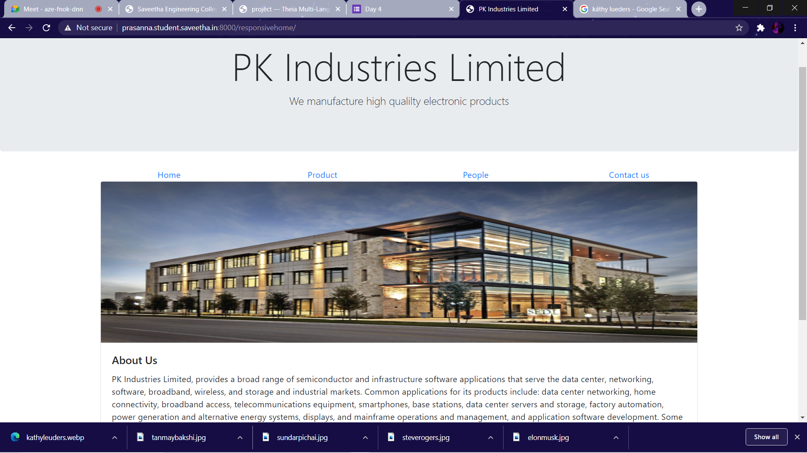
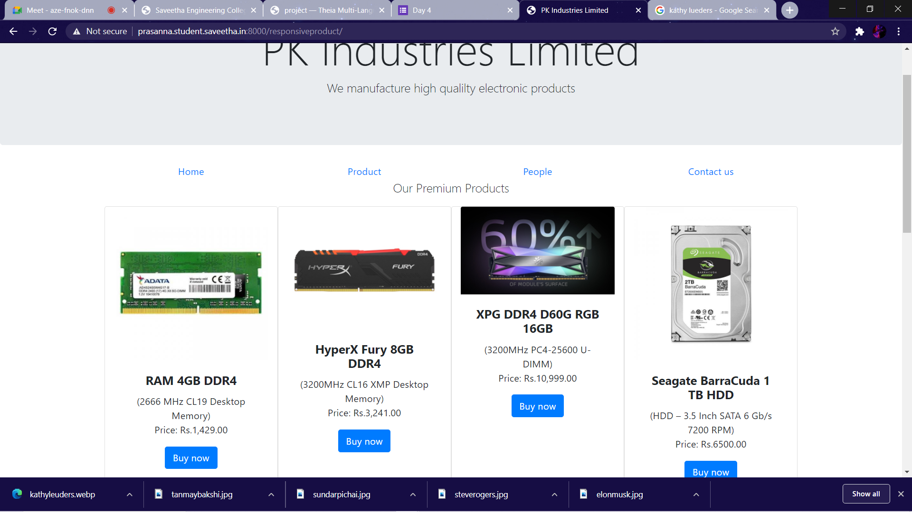
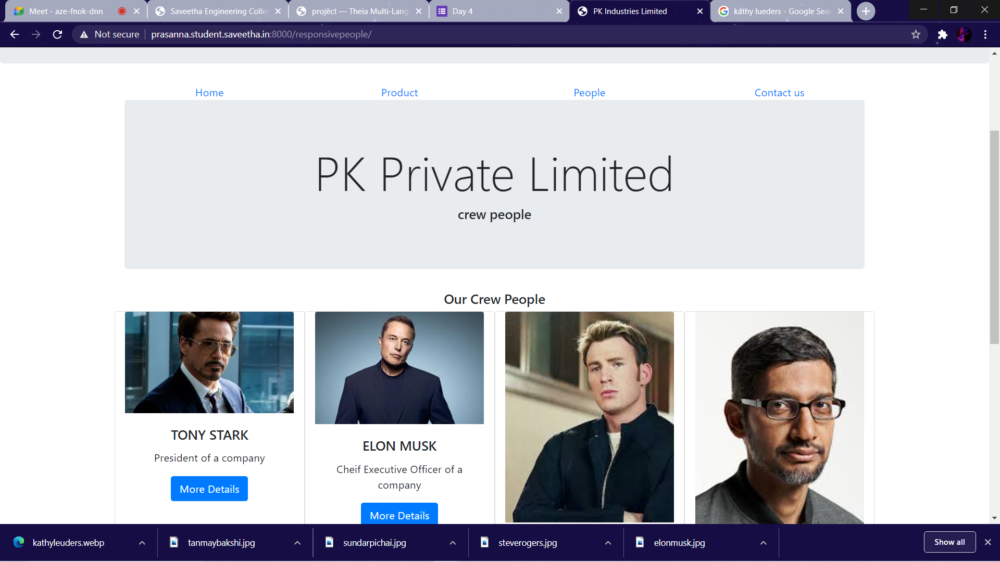
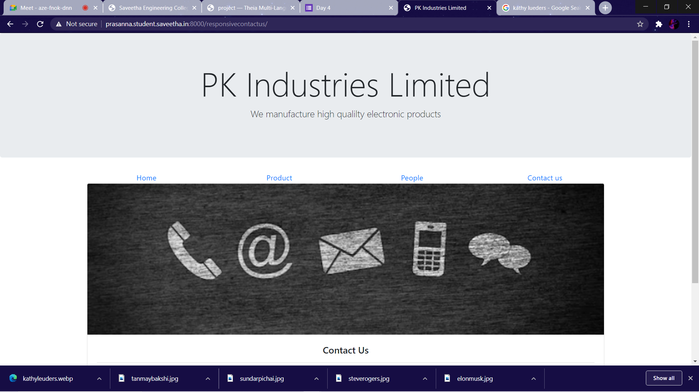
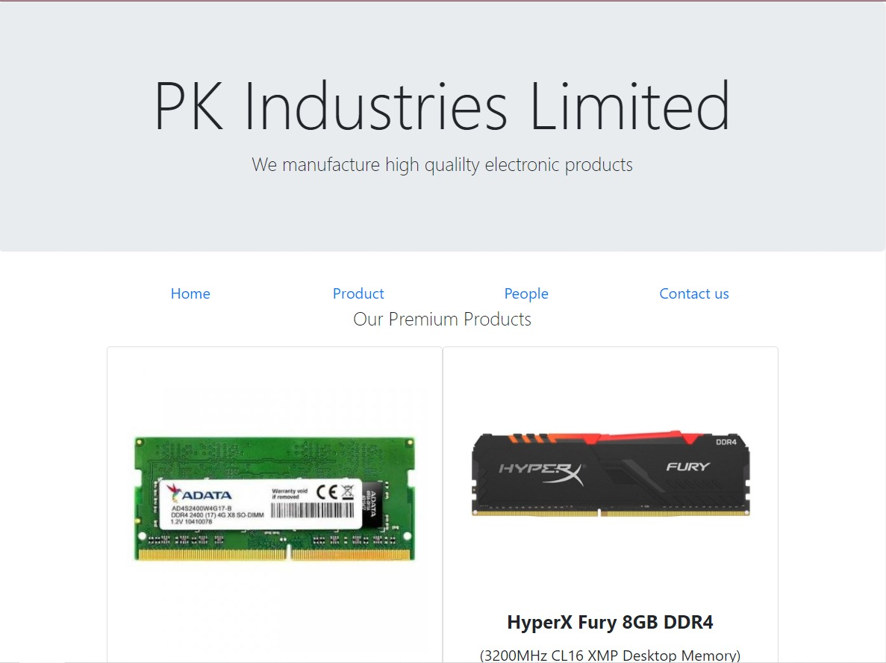
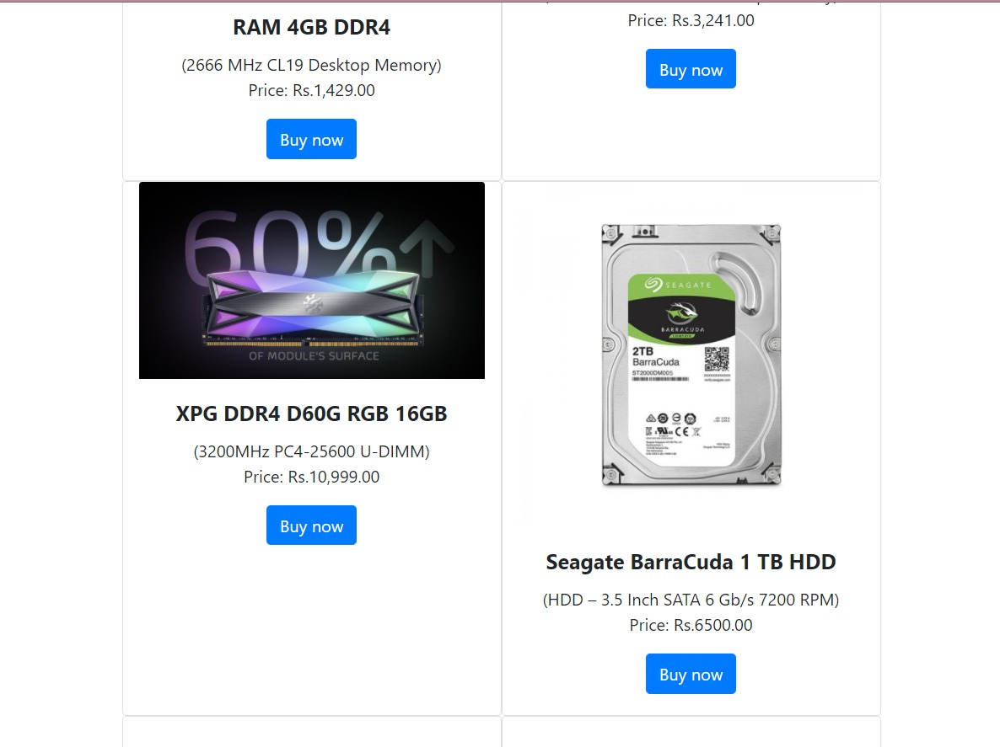
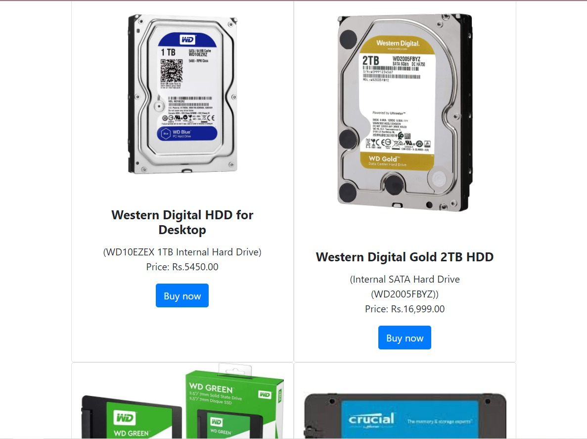
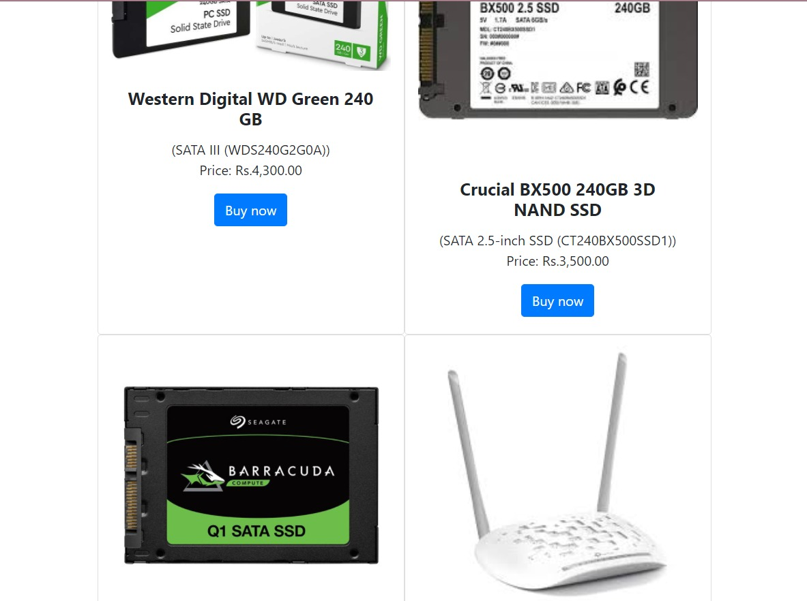
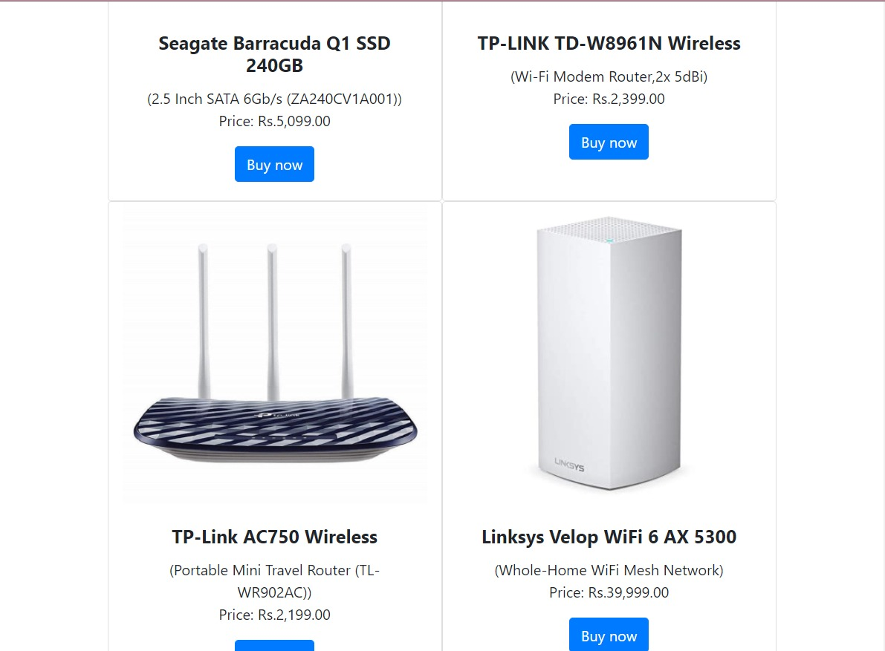

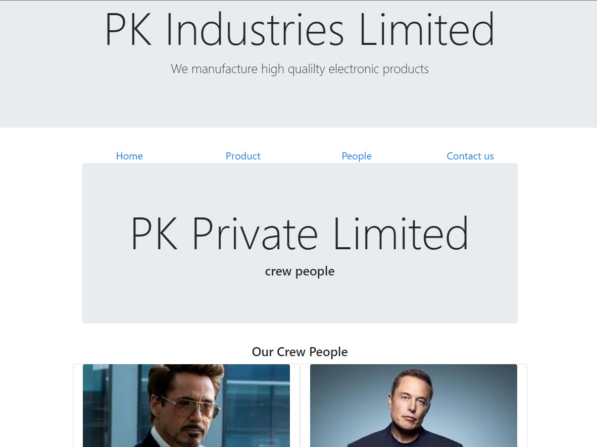


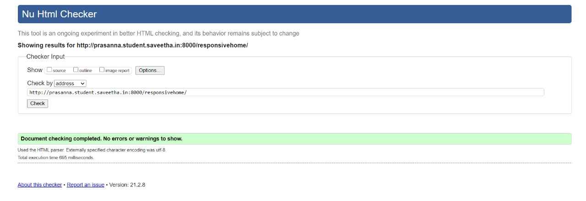
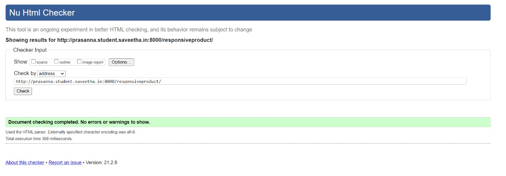
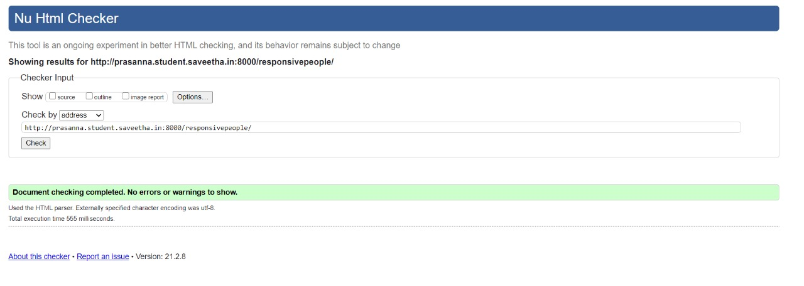
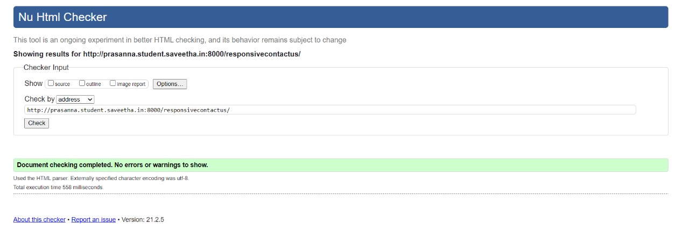
## RESULT:
Thus, a responsive website with two break points is designed and is hosted in the URL 
http://prasanna.student.saveetha.in:8000/